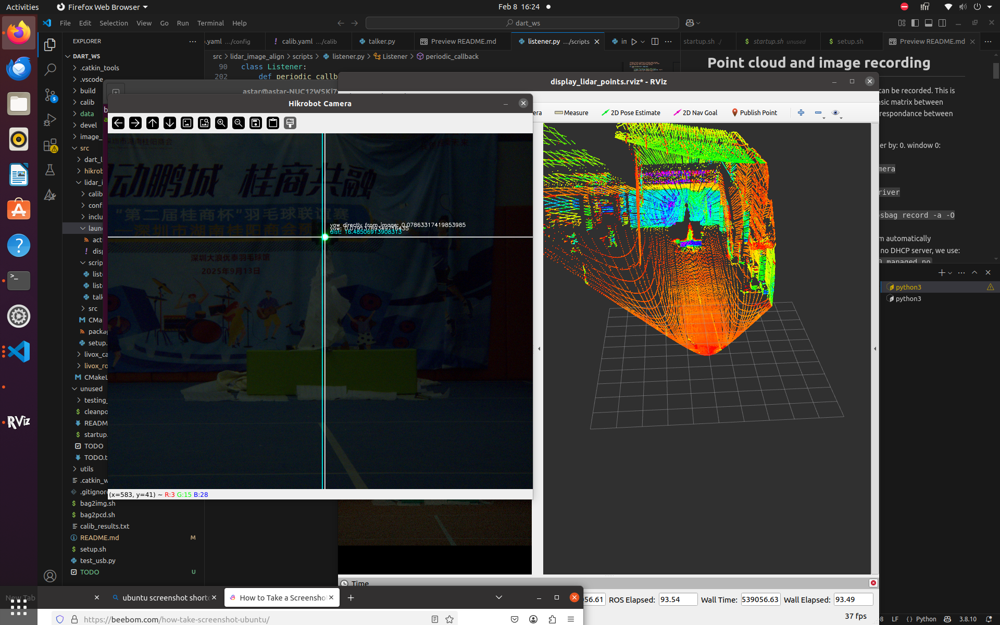
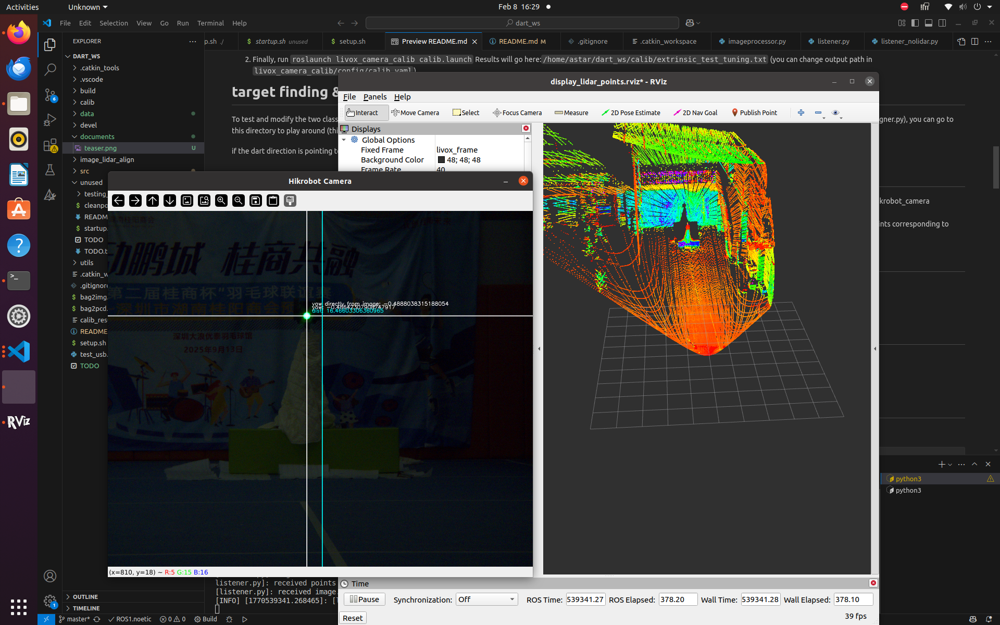

# Lidar target finding algorithm
This package leverages lidar point cloud and RGB camera to detect target green light and report its position relative to the dart.
It detects the light coordinate on the image using rgb value filter,
then projects the coordinate onto lidar point cloud as a ray.
It finds the points closest to the ray,
and removes the outliers to obtain the most likely points for the target.
Finally, the center of the cluster is considered the target and we transform coordinate to obtain the target position relative to the dart center position. 
The hardwares we use are:
1. Livox Mid70 lidar
2. Hikrobot camera
3. Intel NUC

# Point cloud and image recording
This section describes how point clouds and images can be recorded.
This is important for camera-lidar calibration (finding extrinsic matrix between camera and lidar).
The extrinsic matrix helps find correspondance between image pixels and lidar points.

1. you can record point cloud and camera together by:
    0. window 0: `roscore`
    1. window 1: `roslaunch hikrobot_camera hikrobot_camera.launch`
    2. window 2: `roslaunch livox_ros_driver livox_lidar_rviz.launch`
    3. window 3: `rosbag record -a` or: `rosbag record -a -O calib/shenzhen0207.bag`
    4. Note: TO prevent network manager from automatically overriding the ip that is associated with no DHCP server, we use: `sudo nmcli device set enp100s0 managed no`
2. extract: 
    1. `bash bag2img.sh calib/shenzhen0207.bag`
    2. `bash bag2pcd.sh calib/shenzhen0207.bag`
3. now the results should be in `calib/shenzhen0207/` folder (`img` subfolder and `pcd` subfolder)
    1. `calib/shenzhen0207/img` contains images. select one which looks good (there may be blank images)
    2. `calib/shenzhen0207/output_ascii_cropped.pcd` contains the ascii form of point cloud, cropped to help with image alignment.


# Lidar camera calib
1. if you want to fine-tune parameters,
    1. check which yaml file you are using for edge detection parameters, in: `/home/astar/dart_ws/src/livox_camera_calib/config/calib.yaml`'s `calib_config_file` field. It is usually: `/home/astar/dart_ws/src/livox_camera_calib/config/config_outdoor.yaml`
    2. go to to adjust your parameters for edge detection.
    and then run: `roslaunch livox_camera_calib adjust_calib_param.launch`
    see if the lines from image (blue) and lines from point cloud (red) are good.
    If they are clear and easy to match, you can go back to launch using calib.launch.
    (don't forget to change camera matrix in `calib.yaml`!!!!)

2. Finally, run `roslaunch livox_camera_calib calib.launch`
Results will go here:`/home/astar/dart_ws/calib/extrinsic_test_tuning.txt` (you can change output path in `livox_camera_calib/config/calib.yaml`)


# target finding & reporting
To test and modify the two classes for identifying object's pixel coordinate (GLPosition in imageprocessor.py) and matching pixel coordinate to point cloud points (ImageLidarAligner in imagelidaraligner.py), you can go to this directory to play around (this does not require the use of ros and should be faster): `/home/astar/dart_ws/image_lidar_align`.

if the dart direction is pointing to the left of the target, we report a negative angle.

## Step 1: general setup
1. set camera param path in lidar_image_align's `listener.py`: `CAMERA_PARAM_PATH = "/home/astar/dart_ws/src/livox_camera_calib/config/calib_ori.yaml"` 
roslaunch hikrobot_camera hikrobot_camera_save.launch
2. set how many frames of point cloud we want to aggregate together for resolving target distance by: `MAX_PCD_MESSAGES = 6` (we collect 6 frames, pool all points together, and find the points corresponding to target object among these points)

## Step 2: Mock test (with fake data)
1. point cloud: `rosbag play /home/astar/dart_ws/calib/shenzhen0207.bag /hikrobot_camera/rgb:=/dev_null/hikrobot_camera/rgb`
2. image: `rosrun lidar_image_align talker.py`
3. run main program: `rosrun lidar_image_align listener.py`

## Step 2: actual run (with real data):
1. point cloud: `roslaunch livox_ros_driver livox_lidar_rviz.launch`
2. image: `roslaunch hikrobot_camera hikrobot_camera.launch`
3. run main program: `rosrun lidar_image_align listener.py`
 
The center of the green light will be marked by a white cross.
The image center x coordinate will be marked by a blue line.

## Step 3: debug
uncomment these three lines in listener.py: 

``` Python
#save_im_pcd(image=myimg, point_cloud=mypts)
closest_pts = imagelidaraligner.array_to_pointcloud(closest_pts)
valid_pts = imagelidaraligner.array_to_pointcloud(valid_pts)
imagelidaraligner.visualize_point_clouds(valid_pts, closest_pts)
```

then run according to step 2. We can see the background point cloud being red and selected points being blue. Check if the blue points correspond to the green light. If the point clouds are initially too spare, close the window several times until point cloud accumulates enough density.


# Communication
1. one of the USB port is not working. Please make sure you are not plugged into the wrong USB port
2. remember to `sudo chmod 766 /dev/ttyUSB0`
3. if you still encounter unknown issues, you can run `python test_usb.py`, which sends a 18-byte package starting with A3. This may help you debug.

# Start on startup (DANGEROUS)
1. `/etc/systemd/system/rm-dart-vision.service`
2. `sudo chmod 777 /etc/systemd/system/rm-dart-vision.service`
3. `sudo systemctl enable rm-dart-vision.service`
4. `sudo systemctl start rm-dart-vision.service`
5. `sudo systemctl stop rm-dart-vision.service`
6. `sudo systemctl disable rm-dart-vision.service`
*Note: be very careful because starting it as a system service will hold camera's lock, making running the program on the computer impossible (and the problem is very hard to detect! When you have something to do with systemctl and you encounter camera problem, check if the lock of camera is held by another process. Disable the service instead of killing it, since it may respawn.*


# Important:
1. `/home/astar/dart_ws/src/livox_ros_driver/livox_ros_driver/launch/livox_lidar_rviz.launch`: required=true to respawn=true for `livox_lidar_publisher`


# Below are more detailed descriptions about the software. If you encountered problems, you may refer to below contents.


# 1. Hikrobot camera data collection
camera image topic: `/hikrobot_camera/rgb`
## camera calibration
To run calibration, do: `rosrun camera_calibration cameracalibrator.py --size 11x8 --square 0.108 image:=/hikrobot_camera/rgb`

## save camera image
To save image, run: `roslaunch hikrobot_camera hikrobot_camera_save.launch`

## in case we get images with all pixel values equal to 0
change from: `camera::frame = cv::Mat(stImageInfo.nHeight, stImageInfo.nWidth, CV_8UC3, m_pBufForSaveImage).clone(); //tmp.clone();`
to `camera::frame = cv::Mat(stImageInfo.nHeight, stImageInfo.nWidth, CV_8UC3, m_pBufForDriver).clone();`


# 2. Livox lidar point cloud collection
point cloud topic: `/livox_points`

## livox point cloud publish
1. To start publishing livox point cloud, do: 
`sudo ip addr add 192.168.1.100/24 dev enp100s0` to configure the ip (the addr is an example. You have to make sure lidar and your computer is in the same subnet)
go to Livox Viewer to check the IP of lidar (will show a warning message if computer is not on the same subnet as lidar, the warning message will contain lidar ip)

2. `roslaunch livox_ros_driver livox_lidar_rviz.launch` to launch

## record point cloud
1. terminal one: `roscore`

2. terminal two: `roslaunch livox_ros_driver livox_lidar_rviz.launch`

3. terminal three: `rosbag record -a` or: `rosbag record -a -O calib/calibpointcloud/calibscene_test.bag`

4. `control + C` to stop recording

## visualize collected point cloud in .bag file
1. terminal one: `roscore`

2. terminal two: `rosrun rviz rviz`

3. in RVIZ GUI: in lower left corner, select "add" option, choose "PointCloud2", change the "Topic" field to "/livox/lidar"
In top left, Global Options' "fixed frame" field, change contents to "livox_frame"

4. terminal three: `rosbag play ***.bag`

## change .bag file to .pcd file:
1. first, transform topic in /livox_points to pcd into a directory`rosrun pcl_ros bag_to_pcd xxx.bag /livox_points pcd`. 
For example, `rosrun pcl_ros bag_to_pcd calib/calibpointcloud/calibscene_test.bag /livox/lidar /home/astar/dart_ws/calib/calibpointcloud/calibscene_test`

2. then, merge all pcd files into one: `pcl_concatenate_points_pcd /home/astar/dart_ws/calib/calibpointcloud/calibscene_test/* && mv output.pcd /home/astar/dart_ws/calib/calibpointcloud/calibscene_test.pcd `

3. convert to ascii: `pcl_convert_pcd_ascii_binary /home/astar/dart_ws/calib/calibpointcloud/calibscene_test.pcd /home/astar/dart_ws/calib/calibpointcloud/calibscene_test_ascii.pcd 0`

4. visualize the final pcd file: `pcl_viewer /home/astar/dart_ws/calib/calibpointcloud/calibscene.pcd`

<!-- `pcl_converter input.pcd output.txt -format txt` -->


### side notes
1. if you installed Hikrobot camera SDK on this machine, you may encounter a problem when running bag_to_pcd:`undefined symbol: libusb_set_option`;\
**solution**: add this line at the end of ~/.bashrc: `export LD_LIBRARY_PATH=/usr/lib/x86_64-linux-gnu:$LD_LIBRARY_PATH`. This ensures we can use the system's library.

<!-- ## change to readable form
1. does not seem to work: `rostopic echo -b xxx.bag /livox_points > xxx.txt`. -->

## cropping point cloud
**Important!!!!!!!** If you wish to manipulate point cloud, remember to include the intensity field. Otherwise, a point cloud without intensity field will lead to livox_camera_calib reporting error.

1. set parameters in `/home/astar/dart_ws/image_lidar_align/croppointcloud.py`

2. run: `python3 /home/astar/dart_ws/image_lidar_align/croppointcloud.py`. 

Notes: To correctly use livox_camera_calib, you need to ensure intensity field exists in point cloud data. To read the intensity of point cloud, you can use pyntcloud. It allows you to extract the intensity field.\
There does not seem to be a library that can directly write point cloud with "intensity" field, and you have to implement writing functionality on your own. For reference, see the end of the file croppointcloud.py.

# 3. Lidar camera calib
1. transform point cloud to ascii encoding: `pcl_convert_pcd_ascii_binary /home/astar/dart_ws/calib/calibpointcloud/calibscene.pcd /home/astar/dart_ws/calib/calibpointcloud/calibscene_ascii.pcd 0`

2. modify contents in livox_camera_calib/config/calib.yaml
run `roslaunch livox_camera_calib calib.launch`

$_{L}^{C}T = (_{L}^{C}R, _{L}^{C}t)\in SE$

## 3.1. automated converting-cropping
We have a bash file for converting a bag file directly to a cropped point cloud file in ascii format, then cropping it (such that we can correctly perform the alignment using MARS lab's algorithm).
`bash /home/astar/dart_ws/bag2pcd.sh /home/astar/dart_ws/testing_data/test0.bag`

# 4. Working together

## Notes about testing detection & projection
To test and modify the two classes for identifying object's pixel coordinate (GLPosition in imageprocessor.py) and matching pixel coordinate to point cloud points (ImageLidarAligner in imagelidaraligner.py), you can go to this directory to play around (this does not require the use of ros and should be faster): `/home/astar/dart_ws/image_lidar_align`

if the dart direction is pointing to the left of the target, we report a negative angle.

## Step 1: general setup
1. set camera param path in lidar_image_align's listener.py: `CAMERA_PARAM_PATH = "/home/astar/dart_ws/src/livox_camera_calib/config/calib_ori.yaml"` 
roslaunch hikrobot_camera hikrobot_camera_save.launch
2. set how many frames of point cloud we want to aggregate together for resolving target distance by: `MAX_PCD_MESSAGES = 6` (we collect 6 frames, pool all points together, and find the points corresponding to target object among these points)

## Step 2: Mock test (with fake data)
1. point cloud: `rosbag play /home/astar/dart_ws/calib/calibpointcloud/shenzhen0207.bag /hikrobot_camera/rgb:=/dev_null/hikrobot_camera/rgb`

2. image: `rosrun lidar_image_align talker.py`

3. run main program: `rosrun lidar_image_align listener.py`

## Step 2: actual run (with real data):
1. point cloud: `roslaunch livox_ros_driver livox_lidar_rviz.launch`

2. image: `roslaunch hikrobot_camera hikrobot_camera.launch`

3. run main program: `rosrun lidar_image_align listener.py`


caution: when livox_camera_calib reports empty point cloud, check your camera's distortion coefficient


# 5. Test 
## collecting test data
1. first, start publishing images: `roslaunch hikrobot_camera hikrobot_camera_rviz.launch`
and start publishing point cloud: `roslaunch livox_ros_driver livox_lidar_rviz.launch`

2. then, record: `rosbag record -a -O testing_data/test0.bag`

# 6. Visualize lidar and camera
1. run `roscore` in one terminal
2. run `rviz` in another terminal
3. in rviz window, change "fixed frame" property from "map" (or any other things) to "livox_frame". This ensures correct display of lidar points
4. add->by topic->/hikrobot_camera/rgb-> select "image" (NOT camera)
5. add->by topic->/livox/lidar/PointCloud2


<!-- # ======================================================================== -->
# 7. Communication
1. one of the USB port is not working. Please make sure you are not plugged into the wrong USB port
2. remember to `sudo chmod 766 /dev/ttyUSB0`
3. if you still encounter unknown issues, you can run `python test_usb.py`, which sends a 18-byte package starting with A3. This may help you debug.

# 8. Other
1. `export LD_LIBRARY_PATH=/opt/MVS/lib/64:/opt/MVS/lib/32:/opt/MVS/lib/64:/opt/MVS/lib/32:/opt/MVS/bin` if you cannot find xcb

# modify extrinsic matrix:
1. we assume the translation is correct and we only play around with rotation. We can find the adjust code at: `utils/adjustextrinsic/countNewMat.py`
    1. input: x, y, z
        1. x: positive -> elevate the 3D scene up
        2. y: positive -> rotate 3D scene right
        3. z: positive -> rotate 3D scene clockwise
